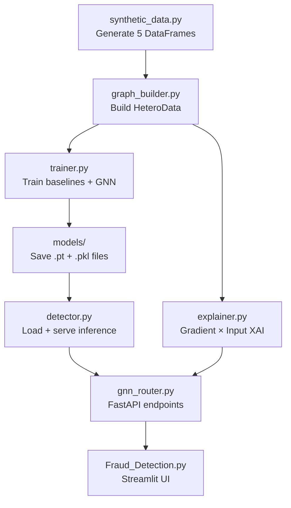
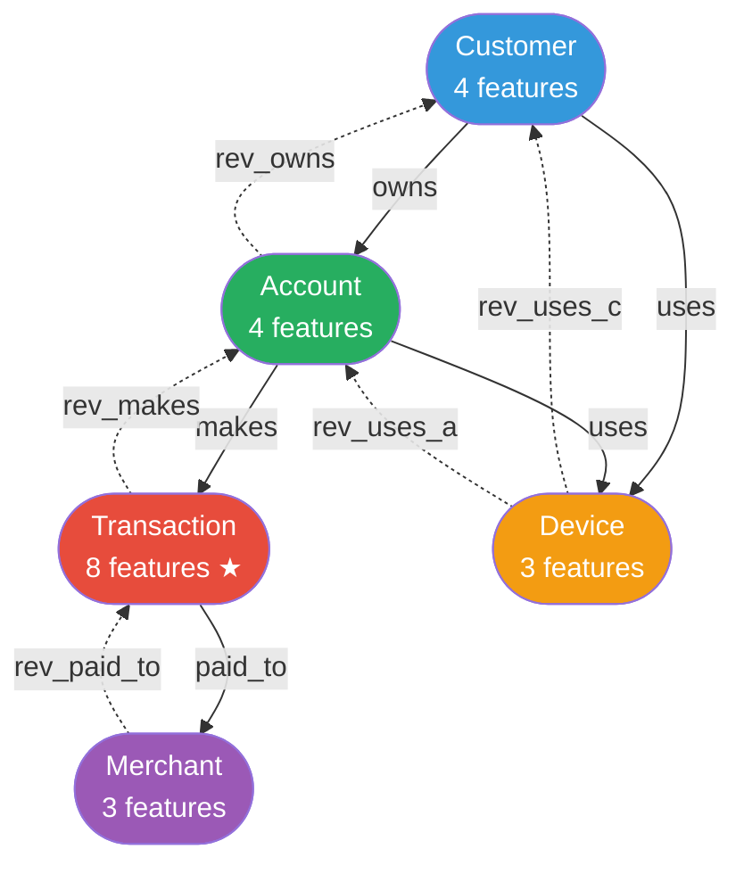
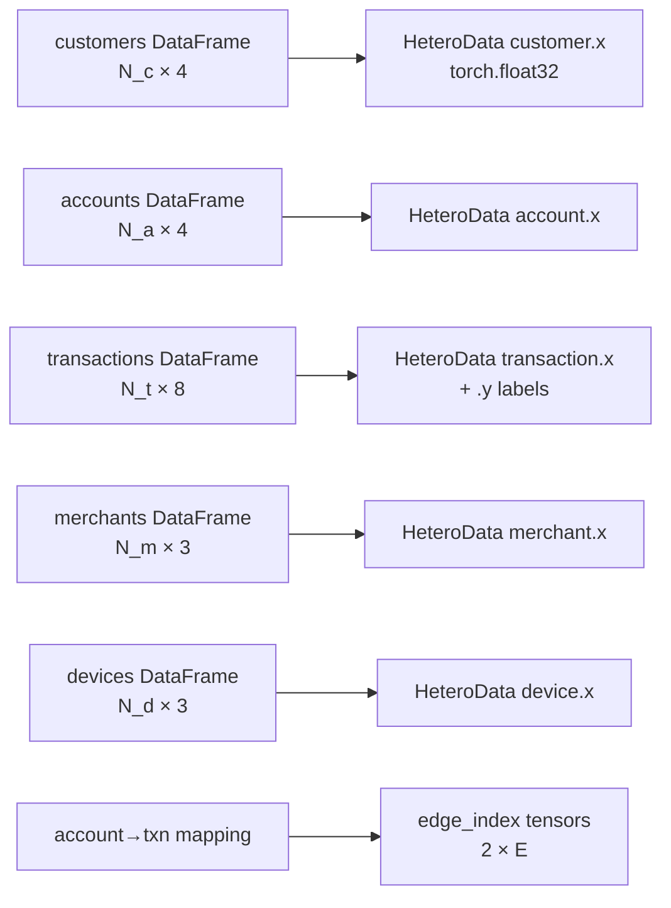
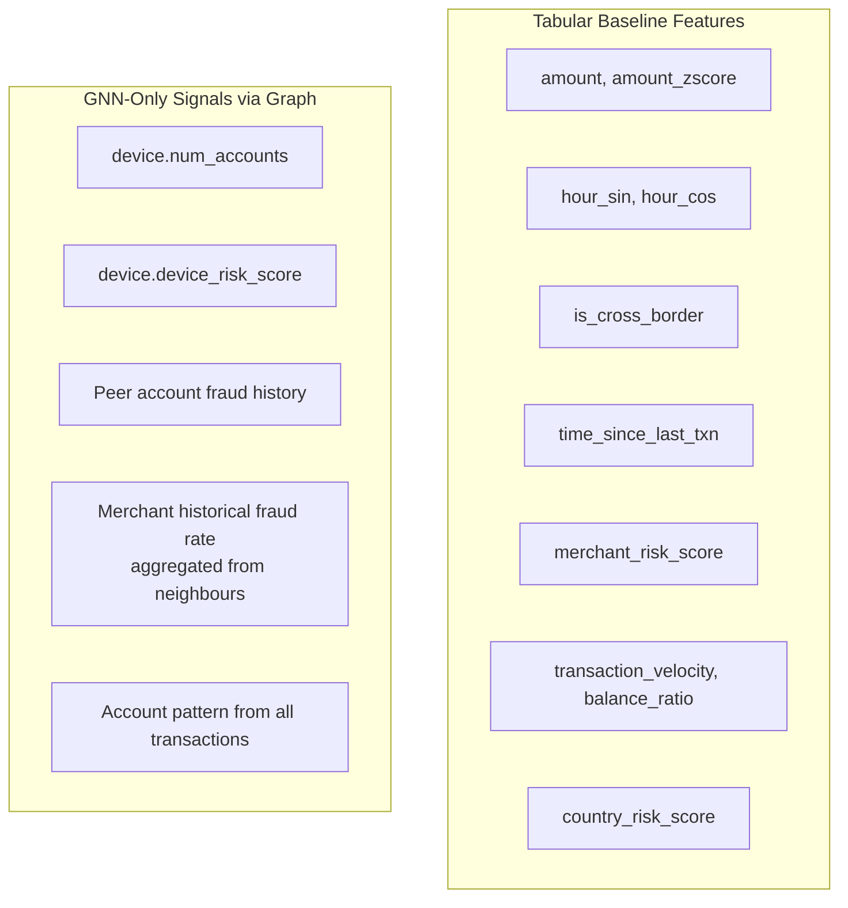
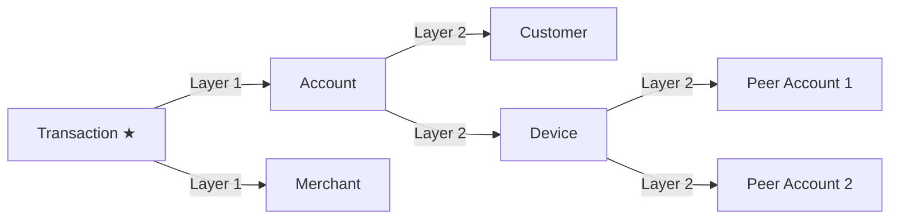
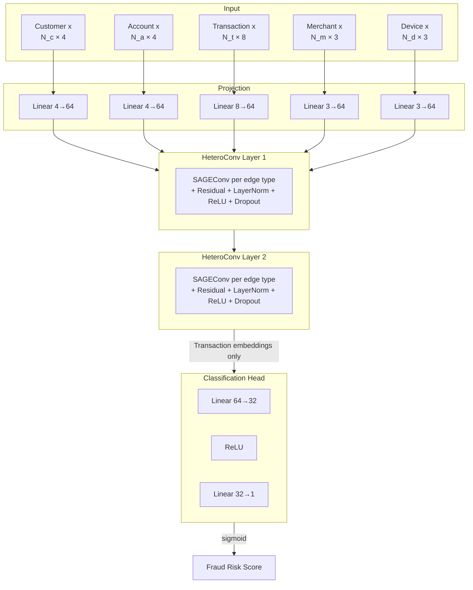

# Phase 10 — GNN Fraud Detection: A Complete Teaching Guide

> ⚠ **SYNTHETIC DEMONSTRATION** — This module uses artificially generated
> transaction data with deliberately planted fraud patterns. It is NOT trained
> on real customer transactions and does NOT represent actual fraud rates,
> real banking behaviour, or a deployable fraud detection system.
> For educational purposes only.

---

## Table of Contents

**Part I — Why Graphs?**
1. [The Isolation Problem in Traditional Fraud Detection](#1-the-isolation-problem)
2. [What a Graph Adds](#2-what-a-graph-adds)
3. [The Core Question This Module Answers](#3-the-core-question)
4. [Module Architecture Overview](#4-module-architecture-overview)

**Part II — The Graph Schema**
5. [Heterogeneous vs Homogeneous Graphs](#5-heterogeneous-vs-homogeneous-graphs)
6. [Node Type: Customer](#6-node-type-customer)
7. [Node Type: Account](#7-node-type-account)
8. [Node Type: Transaction](#8-node-type-transaction)
9. [Node Type: Merchant](#9-node-type-merchant)
10. [Node Type: Device](#10-node-type-device)
11. [Edge Type: customer → owns → account](#11-edge-type-owns)
12. [Edge Type: account → makes → transaction](#12-edge-type-makes)
13. [Edge Type: transaction → paid_to → merchant](#13-edge-type-paid_to)
14. [Edge Type: customer/account → uses → device](#14-edge-type-uses)
15. [Reverse Edges and Bidirectional Message Passing](#15-reverse-edges)
16. [Complete Schema Diagram](#16-complete-schema-diagram)

**Part III — The Synthetic Dataset**
17. [Why Synthetic Data?](#17-why-synthetic-data)
18. [Fraud Pattern A: Tabular Signals](#18-fraud-pattern-a)
19. [Fraud Pattern B: Ring Fraud (The GNN Showcase)](#19-fraud-pattern-b)
20. [Fraud Pattern C: High-Risk Merchant](#20-fraud-pattern-c)
21. [Fraud Pattern D: Velocity Burst](#21-fraud-pattern-d)
22. [Class Imbalance and Fraud Rate Calibration](#22-class-imbalance)
23. [The Demo Transactions](#23-the-demo-transactions)

**Part IV — Graph Construction**
24. [From DataFrames to HeteroData](#24-from-dataframes-to-heterodata)
25. [Node Feature Encoding](#25-node-feature-encoding)
26. [Edge Index Construction](#26-edge-index-construction)
27. [Train / Val / Test Split (Temporal)](#27-temporal-split)
28. [The NumPy 2.x Compatibility Issue](#28-numpy-compatibility)

**Part V — Tabular Baselines**
29. [Why Train a Baseline First?](#29-why-train-a-baseline-first)
30. [Logistic Regression Baseline](#30-logistic-regression-baseline)
31. [LightGBM Baseline](#31-lightgbm-baseline)
32. [What the Baseline Sees vs What the GNN Sees](#32-baseline-vs-gnn-features)

**Part VI — GNN Architecture**
33. [Message Passing: The Core Idea](#33-message-passing)
34. [GraphSAGE Convolution (SAGEConv)](#34-graphsage-conv)
35. [HeteroConv: Handling Multiple Edge Types](#35-heteroconv)
36. [Input Projection Layer](#36-input-projection)
37. [Residual Connections and LayerNorm](#37-residual-and-layernorm)
38. [Why 2 Layers? The 2-Hop Neighbourhood](#38-why-2-layers)
39. [Classification Head](#39-classification-head)
40. [Complete Architecture Diagram](#40-complete-architecture-diagram)

**Part VII — Training**
41. [Loss Function: BCEWithLogitsLoss + pos_weight](#41-loss-function)
42. [Optimiser and Learning Rate Schedule](#42-optimiser)
43. [Early Stopping on PR-AUC](#43-early-stopping)
44. [Why PR-AUC Not ROC-AUC?](#44-pr-auc-vs-roc-auc)

**Part VIII — Evaluation**
45. [Overall Metrics on Test Set](#45-overall-metrics)
46. [The Key Comparison: Pattern B Recall](#46-pattern-b-recall)
47. [Graph Leakage and the Transductive Setting](#47-graph-leakage)

**Part IX — Explainability (XAI)**
48. [Why Explainability Matters for Fraud](#48-why-xai)
49. [Gradient × Input Attribution](#49-gradient-x-input)
50. [Reading the Explanation Output](#50-reading-explanations)
51. [Caveats: Attribution ≠ Causation](#51-attribution-caveats)

**Part X — Inference and Decision Policy**
52. [Single-Transaction API Inference](#52-single-transaction-inference)
53. [The Decision Policy (APPROVE / REVIEW / BLOCK)](#53-decision-policy)
54. [Trace One Transaction End-to-End](#54-trace-one-transaction)

**Part XI — Using the GNN Fraud Detection Demo**
55. [The Demo UI Layout](#55-the-demo-ui-layout)
56. [Every Input Field in the Scoring Form](#56-every-input-field-in-the-scoring-form)
57. [What Does the Fraud Risk Score Mean?](#57-what-does-the-fraud-risk-score-mean)
58. [The APPROVE / REVIEW / BLOCK Decision](#58-the-approve--review--block-decision)
59. [Structured Testing Tutorial](#59-structured-testing-tutorial)
60. [Model Architecture Reference](#60-model-architecture-reference)

---

## Part I — Why Graphs?

### 1. The Isolation Problem

**Concept**: Traditional ML fraud detection scores each transaction as an independent data point.

**Real-world intuition**: Imagine a bank analyst reviewing a suspicious payment. She doesn't look at the payment in isolation — she pulls up the account's history, checks if the device has appeared before, looks at whether the merchant has received payments from fraud victims in the past. Context matters.

**How it applies to fraud**: A transaction for £240 at a grocery store looks completely normal. But if the account making that transaction shares a device fingerprint with eight other accounts that have a 90% fraud rate, the analyst would flag it immediately. That signal does not exist in the row for the £240 transaction — it only exists as a *relationship* in a network.

**How we implement it**: We represent the banking data as a heterogeneous graph where nodes are entities (customers, accounts, transactions, merchants, devices) and edges are relationships between them.

**File**: `src/camel_sentinel/gnn/graph_builder.py`

---

### 2. What a Graph Adds

**Concept**: Graph Neural Networks allow a node to incorporate information from its neighbours during classification.

**Real-world intuition**: In a social network, your friends' behaviour predicts your behaviour better than demographic statistics alone. In banking, an account's *neighbourhood* (shared devices, transaction history, merchant connections) predicts fraud better than the transaction's features alone.

**How it applies to fraud**: Three patterns that require graph reasoning:

| Fraud Pattern | What it looks like | Why tabular fails |
|--------------|-------------------|-------------------|
| Device ring | Account shares device with high-fraud accounts | The sharing relationship isn't a column |
| Merchant contamination | Merchant has received payments from 40 fraud victims | Merchant history isn't in the transaction row |
| Coordinated burst | Five accounts send to the same merchant at 3 AM | Coordination is a graph pattern, not a feature |

**How we implement it**: A 2-layer GNN propagates signals over edges, so a transaction can "see" its account's device, its merchant's fraud history, and the account's customer — all through message passing.

**File**: `src/camel_sentinel/gnn/model.py`

---

### 3. The Core Question

**Concept**: This module answers a concrete empirical question, not just "can GNNs do fraud detection."

**The question**: *Does graph neighbourhood information provide additional predictive value beyond transaction features alone — specifically for fraud transactions whose own features look normal?*

**Why this framing matters**: Saying "GNNs are better" is a marketing claim. Saying "GNN recall on Pattern B (ring fraud) is 15 percentage points higher than the tabular baseline at the same precision" is an empirical finding.

**How we answer it**: We plant a specific fraud pattern (Pattern B) whose transaction features are deliberately normal, train both a tabular model and a GNN on the same data, then compare recall on Pattern B transactions specifically.

**File**: `src/camel_sentinel/gnn/trainer.py` — `evaluate_all()` function

---

### 4. Module Architecture Overview

**Concept**: This module is a self-contained pipeline from data generation to a scored API response.



**Files involved**:

| File | Role |
|------|------|
| `src/camel_sentinel/gnn/synthetic_data.py` | Generate synthetic banking data with planted fraud |
| `src/camel_sentinel/gnn/graph_builder.py` | Convert DataFrames to PyG HeteroData |
| `src/camel_sentinel/gnn/model.py` | HeteroGNN architecture definition |
| `src/camel_sentinel/gnn/trainer.py` | Training loop, baselines, evaluation, save/load |
| `src/camel_sentinel/gnn/explainer.py` | Gradient × input attribution |
| `src/camel_sentinel/gnn/detector.py` | Inference wrapper + FraudPolicy |
| `backend/gnn_router.py` | FastAPI router |
| `frontend/views/3_🕸️_Fraud_Detection.py` | Streamlit UI |

---

## Part II — The Graph Schema

### 5. Heterogeneous vs Homogeneous Graphs

**Concept**: A homogeneous graph has one type of node and one type of edge. A heterogeneous graph has multiple types of both.

**Real-world intuition**: A social network where every node is a "person" and every edge is "friendship" is homogeneous. A knowledge graph where nodes can be "person", "company", "country", and edges can be "works_at", "born_in", "owns" is heterogeneous.

**How it applies to fraud**: Our banking graph has 5 different entity types (customer, account, transaction, merchant, device) and 5 different relationship types. Treating them all the same would lose important structural information — the relationship "account → uses → device" means something fundamentally different from "account → makes → transaction".

**How we implement it**: PyTorch Geometric's `HeteroData` class stores separate feature tensors and edge index tensors for each (node_type) and (src_type, edge_type, dst_type) triple. Our GNN uses `HeteroConv` to apply different learned transformations per edge type.

**File**: `src/camel_sentinel/gnn/graph_builder.py`, `src/camel_sentinel/gnn/model.py`

---

### 6. Node Type: Customer

**Concept**: A customer is the human identity behind one or more bank accounts.

**Why it exists in the graph**: Identity-level signals — country risk, customer age, tenure — travel from the customer node to all transactions made through their accounts. Additionally, if a customer uses a device that is shared with many other customers, the device-sharing ring is detectable through the customer → uses → device edge.

**Features (4)**:

| Feature | Description | Fraud signal |
|---------|-------------|--------------|
| `age` | Customer age in years | Young accounts more targeted |
| `tenure_days` | Days since account opening | Short tenure correlates with fraud ring setup |
| `country_risk_score` | 1 (low) – 4 (high) | High-risk origin countries |
| `num_accounts` | Accounts owned | Many accounts per customer suggests fraud ring |

**File**: `src/camel_sentinel/gnn/synthetic_data.py` — customers DataFrame; `src/camel_sentinel/gnn/graph_builder.py` — `CUSTOMER_FEATURES` list

---

### 7. Node Type: Account

**Concept**: A bank account bridges a customer's identity to their transaction history.

**Why it exists in the graph**: Account-level velocity and balance statistics capture patterns that a single transaction cannot. An account that normally processes £200 transactions and suddenly processes a £5,000 transaction — that contextual signal lives at the account node and propagates to the transaction via `account → makes → transaction`.

**Features (4)**:

| Feature | Description | Fraud signal |
|---------|-------------|--------------|
| `balance` | Current balance | Sudden large withdrawals relative to balance |
| `avg_transaction_amount` | Historical average | Enables amount z-score calculation |
| `transaction_velocity` | Transactions per day | Velocity burst pattern |
| `account_age_days` | Days since creation | Newly opened accounts are higher risk |

**File**: `src/camel_sentinel/gnn/synthetic_data.py` — accounts DataFrame

---

### 8. Node Type: Transaction

**Concept**: The entity being classified — every transaction gets a fraud risk score.

**Why it's the target node**: The fraud label (`is_fraud`) lives on transaction nodes. The GNN's final output layer produces one score per transaction node in the classification split.

**Features (8)**:

| Feature | Description | Fraud signal |
|---------|-------------|--------------|
| `amount` | Raw transaction amount | High amounts |
| `amount_zscore` | (amount − account_mean) / account_std | Unusually large for this account |
| `hour_sin`, `hour_cos` | Cyclic hour encoding | Late night / early morning activity |
| `is_cross_border` | 1 if international | Cross-border transactions are higher risk |
| `time_since_last_txn` | Seconds since last transaction | Very short = velocity burst |
| `merchant_risk_score` | Static merchant risk | Direct signal from merchant type |
| `merchant_category_enc` | Encoded category | Category-specific risk patterns |

**Cyclic time encoding**: Hours are circular (23:00 and 00:00 are adjacent). Encoding hour `h` as `sin(2π h/24)` and `cos(2π h/24)` preserves this — a model can learn "late night" as a contiguous region in 2D space rather than wrapping around a linear feature.

**File**: `src/camel_sentinel/gnn/graph_builder.py` — `TRANSACTION_FEATURES` list

---

### 9. Node Type: Merchant

**Concept**: The entity receiving the payment.

**Why it exists in the graph**: Fraudsters reuse merchants. A merchant that has received payments from 40 fraud victims has accumulated evidence that propagates to any new transaction paid to that merchant. This is a "guilt by association" signal that is legitimate in fraud detection context.

**Features (3)**:

| Feature | Description | Fraud signal |
|---------|-------------|--------------|
| `merchant_risk_score` | Aggregated historical fraud rate | High = known fraud magnet |
| `transaction_count` | Total transactions received | Low-volume merchants are anomalous |
| `country_risk_score` | Merchant's country risk | Cross-border risk assessment |

**File**: `src/camel_sentinel/gnn/synthetic_data.py` — merchants DataFrame

---

### 10. Node Type: Device

**Concept**: A device fingerprint or IP cluster used to access bank accounts.

**Why it's the strongest relational signal**: Legitimate customers each use their own device. Fraudsters often control many accounts simultaneously using the same device (or small set of devices). A single device associated with 15 different accounts is a near-definitive indicator of a fraud ring — and this pattern is *invisible* in any transaction's own feature columns.

**Features (3)**:

| Feature | Description | Fraud signal |
|---------|-------------|--------------|
| `num_accounts` | Accounts using this device | >3 is already suspicious |
| `num_customers` | Distinct customers on this device | >2 is highly suspicious |
| `device_risk_score` | Aggregated risk (1 = ring device) | Direct ring indicator |

**File**: `src/camel_sentinel/gnn/synthetic_data.py` — devices DataFrame; 12 ring devices created with `num_accounts ∼ Uniform(6, 20)`

---

### 11. Edge Type: owns

**Concept**: `customer → owns → account` connects identity to financial instrument.

**Directionality**: One customer can own many accounts (1:N). A child account knows which parent customer it belongs to via the reverse edge `account → rev_owns → customer`.

**Fraud utility**: Allows the customer's `country_risk_score` and `num_accounts` to flow to the account and then to transactions in layer 2 of message passing.

**File**: `src/camel_sentinel/gnn/graph_builder.py` — `cust_src / acc_dst` edge construction

---

### 12. Edge Type: makes

**Concept**: `account → makes → transaction` is the primary production edge.

**Directionality**: One account makes many transactions (1:N). This is the most traversed edge in message passing — account-level velocity and balance statistics reach every transaction.

**Fraud utility**: An account with high `transaction_velocity` signals velocity-burst fraud (Pattern D) to all transactions it makes.

**File**: `src/camel_sentinel/gnn/graph_builder.py` — `am_src / am_dst` vectorised construction

---

### 13. Edge Type: paid_to

**Concept**: `transaction → paid_to → merchant` connects payments to recipients.

**Directionality**: Many transactions can pay one merchant (N:1). This is the most computationally busy edge — in a graph with 56,000 transactions and 350 merchants, each merchant averages ~160 incoming edges.

**Fraud utility**: A merchant with high `merchant_risk_score` (accumulated from past fraud) propagates that risk back to any transaction paying it — even a transaction with otherwise normal features (Pattern C).

**File**: `src/camel_sentinel/gnn/graph_builder.py` — `mp_src / mp_dst` edge construction

---

### 14. Edge Type: uses

**Concept**: `customer → uses → device` and `account → uses → device` link usage patterns to device fingerprints.

**Two levels**: We include both account-level and customer-level device associations. Account-level is the stronger fraud signal (multiple *accounts* on one device = ring). Customer-level adds the context that one person uses multiple devices (normal) vs one device used by multiple people (suspicious).

**Fraud utility**: This is the sole mechanism by which Pattern B (ring fraud) is detectable. Transaction → account → device → (peer accounts on same device) is a 2-hop path that the GNN can traverse but a tabular model cannot.

**File**: `src/camel_sentinel/gnn/graph_builder.py` — `cu_src / cu_dst` and `au_src / au_dst` construction

---

### 15. Reverse Edges

**Concept**: Each edge type has a reverse edge to enable bidirectional information flow.

**Why necessary**: Standard message passing is directed — information flows from source to destination. But consider `account → makes → transaction`: this means transaction nodes receive account information, but account nodes receive no information from their transactions. Adding `transaction → rev_makes → account` allows the account to aggregate signals from all its transactions (e.g., "one of my transactions is late-night and cross-border").

**The 5 reverse edges**:

| Forward | Reverse |
|---------|---------|
| `customer → owns → account` | `account → rev_owns → customer` |
| `account → makes → transaction` | `transaction → rev_makes → account` |
| `transaction → paid_to → merchant` | `merchant → rev_paid_to → transaction` |
| `customer → uses → device` | `device → rev_uses_c → customer` |
| `account → uses → device` | `device → rev_uses_a → account` |

**File**: `src/camel_sentinel/gnn/graph_builder.py` — all `rev_*` edge_index entries in HeteroData

---

### 16. Complete Schema Diagram



★ Transaction nodes are the classification target — fraud label lives here.

Solid arrows = forward edges. Dashed arrows = reverse edges.

---

## Part III — The Synthetic Dataset

### 17. Why Synthetic Data?

**Concept**: Real fraud data cannot be used for teaching — it contains PII and trade secrets.

**What we sacrifice**: Generalisability. A model trained on synthetic patterns will perform well on synthetic test data but may not transfer to real-world fraud.

**What we gain**: Full control. We can plant exact fraud patterns, know ground truth, and verify empirically that the GNN detects what it should detect.

**The honesty principle**: Every output in this module is labelled "SYNTHETIC DEMONSTRATION". The word "probability" is never used — only "Fraud Risk Score" — because the model score is not calibrated against real fraud rates.

**File**: `src/camel_sentinel/gnn/synthetic_data.py`

---

### 18. Fraud Pattern A: Tabular Signals

**Concept**: Pattern A transactions have suspicious feature values that a standard ML model can detect.

**Planted signals**:
- High amount (5–15× account average)
- Cross-border transaction (`is_cross_border = 1`)
- Unusual hour (0–5 or 22–23)

**Why we include it**: To confirm the tabular baseline works — if the baseline cannot detect Pattern A, we have a bug. High tabular recall on Pattern A is expected and validates the pipeline.

**Share of fraud**: ~16% of all fraudulent transactions

**File**: `src/camel_sentinel/gnn/synthetic_data.py` — `_plant_pattern_a()` function

---

### 19. Fraud Pattern B: Ring Fraud (The GNN Showcase)

**Concept**: Pattern B transactions are deliberately given *normal* transaction features. The only fraud signal is in the graph neighbourhood.

**How the ring is constructed**:
1. 12 "ring" devices are created with `num_accounts ∈ [6, 20]`
2. 289 "ring" accounts are linked to these devices
3. Ring accounts have high `device_risk_score` and elevated `account_age_days` (recently opened)
4. Transactions from ring accounts are labelled fraud with probability 0.18
5. Transaction features are *not* manipulated — amounts, hours, and cross-border flags are all normal

**Why a tabular model fails**: The tabular model sees `amount=£140`, `hour=14`, `is_cross_border=0`, `merchant_risk=0.05` — completely ordinary. It has no column for "number of other accounts on this device" or "aggregate fraud rate of device neighbourhood".

**Why the GNN succeeds**: Through `account → uses → device` and the reverse device edge, the GNN can aggregate signals from all accounts on the same device. If 9 of the 12 co-accounts have high fraud rates, that signal reaches the current transaction within 2 message-passing layers.

**Share of fraud**: ~42% of all fraudulent transactions (the dominant pattern)

**File**: `src/camel_sentinel/gnn/synthetic_data.py` — `_plant_ring_structure()` and `_plant_pattern_b()`

---

### 20. Fraud Pattern C: High-Risk Merchant

**Concept**: Pattern C transactions have normal features but are paid to merchants with high fraud history.

**How it's constructed**: 35 merchants (10% of 350) are designated high-risk with `merchant_risk_score ≥ 0.7`. Transactions to these merchants are labelled fraud with probability 0.009 per transaction (net contribution ~16% of fraud).

**Partially tabular**: Unlike Pattern B, Pattern C is *partially* detectable by the tabular model because `merchant_risk_score` is included as a transaction feature. The GNN has an advantage because it sees the full merchant neighbourhood (transaction history aggregation across many customers), not just the static merchant feature.

**Share of fraud**: ~16% of all fraudulent transactions

**File**: `src/camel_sentinel/gnn/synthetic_data.py`

---

### 21. Fraud Pattern D: Velocity Burst

**Concept**: Pattern D — multiple transactions in rapid succession from one account.

**How it's constructed**: Selected accounts fire a burst of 3–8 transactions within a short time window. `time_since_last_txn` values are very small (seconds apart). These are labelled fraud with probability 0.035.

**Partially tabular**: The tabular model sees `time_since_last_txn` and can partially detect velocity bursts. The GNN adds account-level velocity context (`transaction_velocity` feature on the account node propagated via `account → makes → transaction`).

**Share of fraud**: ~26% of all fraudulent transactions

**File**: `src/camel_sentinel/gnn/synthetic_data.py`

---

### 22. Class Imbalance and Fraud Rate Calibration

**Concept**: Real-world fraud rates are typically 0.1%–2%. A 50% fraud rate in training data produces unrealistically optimistic models.

**Our calibration target**: ~5.8% — higher than real-world (for educational stability) but far from trivially balanced.

**Pattern probabilities (calibrated)**:

| Pattern | Probability | Why this value |
|---------|-------------|----------------|
| A (tabular) | 0.009 per transaction | Low per-row rate; high-signal transactions only |
| B (ring) | 0.18 on ring accounts | Ring accounts are already pre-selected for fraud |
| C (merchant) | 0.009 per transaction | Same as A; partial overlap possible |
| D (velocity) | 0.035 for burst accounts | Higher because bursts are multi-transaction |

**File**: `src/camel_sentinel/gnn/synthetic_data.py` — `generate()` function; calibrated via repeated runs to hit 5.8% overall rate

---

### 23. The Demo Transactions

**Concept**: Three controlled demo transactions illustrate the core GNN vs tabular comparison.

**Demo 1 — Ring neighbourhood**: Normal transaction features (£300, domestic, 2pm), but account belongs to a device shared with 9 other accounts. The GNN assigns elevated risk; the tabular baseline assigns low risk. This is the key educational demonstration.

**Demo 2 — Suspicious features**: High amount (£8,000), 3 AM, cross-border. But account history and device context are clean. Tabular assigns high risk. GNN may assign moderate risk after incorporating the clean account/device context.

**Demo 3 — Raushan's £2,000**: Normal amount, normal hour, domestic, clean account, clean device. Both tabular and GNN should assign low risk. Used as a baseline sanity check.

**Technical note**: Demo transactions have `is_fraud = -1` and are excluded from both training and evaluation. They are scored using mini-graph inference only (5-node subgraph), so Demo 1 will not show full ring-detection power at the API level — that requires full-graph scoring (available in the notebook).

**File**: `src/camel_sentinel/gnn/synthetic_data.py` — `generate()` appends demo rows at end

---

## Part IV — Graph Construction

### 24. From DataFrames to HeteroData

**Concept**: PyTorch Geometric's `HeteroData` is a dictionary-like object holding tensors for each node type and edge type.

**Real-world intuition**: Think of it as a structured database where each "table" is a tensor, and each "foreign key relationship" is an edge index (a 2×E matrix where row 0 = source indices, row 1 = destination indices).

**The conversion process**:



**How we implement it**: The `build_hetero_data()` function in `graph_builder.py` takes the 5 DataFrames from `synthetic_data.generate()` and returns a `HeteroData` object plus a `meta` dict containing index maps and feature column names.

**File**: `src/camel_sentinel/gnn/graph_builder.py` — `build_hetero_data()` function

---

### 25. Node Feature Encoding

**Concept**: All node features are stored as `torch.float32` tensors of shape `[N_nodes, N_features]`.

**Feature lists (constants in graph_builder.py)**:

```python
CUSTOMER_FEATURES  = ["age", "tenure_days", "country_risk_score", "num_accounts"]
ACCOUNT_FEATURES   = ["balance", "avg_transaction_amount", "transaction_velocity", "account_age_days"]
TRANSACTION_FEATURES = ["amount", "amount_zscore", "hour_sin", "hour_cos",
                        "is_cross_border", "time_since_last_txn",
                        "merchant_risk_score", "merchant_category_enc"]
MERCHANT_FEATURES  = ["merchant_risk_score", "transaction_count", "country_risk_score"]
DEVICE_FEATURES    = ["num_accounts", "num_customers", "device_risk_score"]
```

**Cyclic hour encoding**: Before building the graph, `hour_sin` and `hour_cos` are computed from `hour_of_day`:
```python
df["hour_sin"] = np.sin(2 * np.pi * df["hour_of_day"] / 24)
df["hour_cos"] = np.cos(2 * np.pi * df["hour_of_day"] / 24)
```

**File**: `src/camel_sentinel/gnn/graph_builder.py`

---

### 26. Edge Index Construction

**Concept**: An edge index is a `[2, E]` integer tensor where `edge_index[0]` = source node indices and `edge_index[1]` = destination node indices.

**Why vectorised construction matters**: With 56,000 transactions, a Python `for` loop over rows (using `iterrows()`) takes ~49 seconds. Vectorised construction using `.map()` and `.tolist()` takes milliseconds.

**Vectorised pattern**:
```python
# Build integer index maps
acc_idx = {acc_id: i for i, acc_id in enumerate(accounts["account_id"])}

# Map account_id column to integer indices — vectorised, no loop
am_src = transactions["account_id"].map(acc_idx).tolist()  # account indices
am_dst = list(range(len(transactions)))                     # transaction indices

data["account", "makes", "transaction"].edge_index = torch.tensor(
    [am_src, am_dst], dtype=torch.long
)
```

**File**: `src/camel_sentinel/gnn/graph_builder.py`

---

### 27. Temporal Split

**Concept**: Transactions are split into train/val/test by timestamp, not randomly.

**Why temporal (not random)**: Random splitting mixes future and past data, inflating metrics. A temporal split tests whether the model can generalise *forward in time* — predicting fraud on transactions it has never seen, which more closely resembles real deployment.

**Split sizes**:
- Train: earliest 70% of transactions by `created_at`
- Validation: next 15%
- Test: latest 15%

**Implementation**: Transaction rows are sorted by `created_at`. A boolean mask `data["transaction"].train_mask` etc. is attached to the HeteroData object.

**Known limitation**: Accounts, devices, and merchants appear in both train and test sets. The model sees the full graph structure during training, including entities that also appear in test transactions. This is the *transductive* setting and inflates metrics vs a truly cold-start deployment.

**File**: `src/camel_sentinel/gnn/graph_builder.py` — temporal mask creation at end of `build_hetero_data()`

---

### 28. The NumPy 2.x Compatibility Issue

**Concept**: NumPy 2.0 changed its C API in a way that breaks `torch.from_numpy()` in PyTorch < 2.4.

**Symptom**: `RuntimeError: _ARRAY_API not found` or `RuntimeError: Numpy is not available`.

**Root cause**: `torch.from_numpy(arr)` passes a pointer to NumPy's internal array API. NumPy 2.x changed the API structure, so torch < 2.4 cannot find `_ARRAY_API`.

**Fix**: Convert through a Python list, bypassing the numpy-torch bridge entirely:
```python
# BROKEN with numpy 2.x + torch < 2.4:
torch.from_numpy(df[cols].values)

# CORRECT — converts via Python list, no numpy bridge:
torch.tensor(df[cols].values.tolist(), dtype=torch.float32)
```

This is applied everywhere in the codebase: `_to_tensor()` in `graph_builder.py`, `.detach().tolist()` for all outputs, and passing Python lists (not numpy arrays) to sklearn metrics.

**File**: `src/camel_sentinel/gnn/graph_builder.py` — `_to_tensor()` helper function

---

## Part V — Tabular Baselines

### 29. Why Train a Baseline First?

**Concept**: A GNN is only interesting if it outperforms simpler models on the *specific patterns* that require relational reasoning.

**The baseline establishes what is already solvable**: If Logistic Regression achieves 95% PR-AUC, a GNN with 96% PR-AUC is unimpressive. But if LR achieves 95% overall PR-AUC while completely missing Pattern B (ring fraud), and the GNN closes that gap, the GNN has demonstrated genuine added value.

**What the baselines see**:
- Transaction features (8 columns)
- Account stats joined to transaction (velocity, balance_ratio)
- Customer context joined to transaction (country_risk_score)
- They do NOT see: device_num_accounts, device_risk_score, peer account fraud rates

**File**: `src/camel_sentinel/gnn/trainer.py` — `train_baselines()` function

---

### 30. Logistic Regression Baseline

**Concept**: A linear model with L2 regularisation that learns a weighted sum of input features.

**Why include it**: Interpretable, fast, and sets a hard lower bound. If the GNN doesn't beat LR, something is wrong.

**Class imbalance handling**: `class_weight='balanced'` causes sklearn to weight each positive (fraud) sample by `n_negative / n_positive` ≈ 17. This prevents the model from predicting "not fraud" for everything.

**Training**:
```python
from sklearn.linear_model import LogisticRegression
lr_model = LogisticRegression(max_iter=1000, class_weight="balanced", random_state=42)
lr_model.fit(X_train, y_train)
```

**File**: `src/camel_sentinel/gnn/trainer.py`

---

### 31. LightGBM Baseline

**Concept**: A gradient-boosted decision tree ensemble — typically the strongest tabular ML model.

**Why it matters**: LightGBM can learn non-linear combinations of features and is used in production fraud systems. If the GNN only beats LightGBM on Pattern B and not overall, that is still a meaningful finding.

**Class imbalance handling**: `is_unbalance=True` tells LightGBM to weight positive samples automatically.

**File**: `src/camel_sentinel/gnn/trainer.py` — LightGBM is optional (guarded with `try/except ImportError`; if not installed, only LR baseline is trained)

---

### 32. Baseline vs GNN Features

**Concept**: The feature sets for baselines vs GNN differ precisely at the relational signals.



The tabular features are available to both models. The GNN additionally learns from the graph neighbourhood signals in the right column — those signals are what enable Pattern B detection.

**File**: `src/camel_sentinel/gnn/trainer.py` — tabular feature construction uses only the left column features

---

## Part VI — GNN Architecture

### 33. Message Passing: The Core Idea

**Concept**: In a GNN, every node updates its representation by aggregating information from its neighbours, then combining that with its own current representation.

**One message-passing step**:
```
new_representation(v) = COMBINE(
    representation(v),                    # node's own current state
    AGGREGATE({representation(u) : u ∈ N(v)})   # aggregated neighbours
)
```

**Intuition**: Imagine every person in a social network tells their friends their current "fraud suspicion level". Each person then updates their own suspicion level by combining their own suspicion with the average of what they heard from friends. After one round, each person knows about their direct neighbours. After two rounds, each person knows about neighbours-of-neighbours.

**File**: `src/camel_sentinel/gnn/model.py`

---

### 34. GraphSAGE Convolution (SAGEConv)

**Concept**: GraphSAGE (Hamilton et al. 2017) aggregates neighbour representations using the mean, then concatenates with the node's own representation.

**Formula**:
```
h_v^(l+1) = W · CONCAT(h_v^(l), MEAN({h_u^(l) : u ∈ N(v)}))
```

**Why SAGEConv for this graph**:

| Property | SAGEConv | GAT (attention) | GCN |
|----------|----------|----------------|-----|
| Needs many neighbours for meaning | No | Yes | No |
| Computationally simple | Yes | No | Yes |
| Distinguishes own vs neighbour features | Yes | Yes | No |
| Good for sparse, structured graphs | Yes | Overkill | Yes |

Our graph is sparse and structured: each transaction has exactly one account, one merchant, and (via account) one device. SAGEConv is the right tool.

**File**: `src/camel_sentinel/gnn/model.py` — `SAGEConv` imported from `torch_geometric.nn`

---

### 35. HeteroConv: Handling Multiple Edge Types

**Concept**: `HeteroConv` is a wrapper that applies a different GNN operator for each edge type, then aggregates the results per destination node.

**Why necessary**: In our heterogeneous graph, `account → makes → transaction` and `merchant → rev_paid_to → transaction` both update the transaction node, but they carry different semantic information. `HeteroConv` learns separate weights for each.

**Aggregation strategy**: When multiple edge types deliver messages to the same destination node (e.g., transaction receives from both `rev_makes` account and `rev_paid_to` merchant), the results are summed:
```python
HeteroConv({
    ("account", "makes", "transaction"):     SAGEConv(64, 64),
    ("merchant", "rev_paid_to", "transaction"): SAGEConv(64, 64),
    ...
}, aggr="sum")
```

**File**: `src/camel_sentinel/gnn/model.py` — `HeteroConv` imported from `torch_geometric.nn`

---

### 36. Input Projection Layer

**Concept**: Each node type has a different number of input features (4, 4, 8, 3, 3). Before message passing, we project all node types to the same `hidden_dim = 64`.

**Why necessary**: SAGEConv expects consistent embedding dimensions during message passing. We cannot average a 4-dimensional customer vector with an 8-dimensional transaction vector without first mapping them to a common space.

**Implementation**: One `nn.Linear` per node type:
```python
self.input_proj = nn.ModuleDict({
    "customer":    nn.Linear(4, 64),
    "account":     nn.Linear(4, 64),
    "transaction": nn.Linear(8, 64),
    "merchant":    nn.Linear(3, 64),
    "device":      nn.Linear(3, 64),
})
```

**File**: `src/camel_sentinel/gnn/model.py` — `__init__` method

---

### 37. Residual Connections and LayerNorm

**Concept**: Residual connections add the input of a layer to its output, preventing the gradient from vanishing and allowing the model to selectively incorporate new information.

**Why necessary here**: With 2 GNN layers in a heterogeneous graph, node representations can degrade — a phenomenon called *over-smoothing* where all nodes converge to similar representations. Residual connections allow each layer to only learn the *delta* from the previous representation.

**LayerNorm**: Normalises each node's embedding to have zero mean and unit variance within the embedding dimension. This stabilises training and prevents exploding gradients in deep layers.

**Implementation per layer**:
```python
# After each HeteroConv layer, for each node type:
h = conv(h_dict, edge_index_dict)
h["transaction"] = layer_norm(h["transaction"] + h_dict["transaction"])  # residual + norm
h["transaction"] = F.relu(h["transaction"])
h["transaction"] = F.dropout(h["transaction"], p=0.3, training=self.training)
```

**File**: `src/camel_sentinel/gnn/model.py`

---

### 38. Why 2 Layers? The 2-Hop Neighbourhood

**Concept**: The number of GNN layers determines how many "hops" of neighbourhood information each node sees.

**1-hop (layer 1)**: A transaction sees its account, merchant (forward), and also the accounts that made it (reverse).

**2-hop (layer 2)**: A transaction sees its account's customer, its account's device (the ring detector!), and the merchant's other transactions.



**Why not 3 layers**: A 3rd layer would reach the customer's *other* accounts and their transactions — beginning to pull in the global graph structure. This risks over-smoothing (all nodes converge) and dramatically increases computation.

**File**: `src/camel_sentinel/gnn/model.py` — `num_layers=2` default parameter

---

### 39. Classification Head

**Concept**: After 2 rounds of message passing, the transaction node's 64-dimensional embedding is passed through a small MLP to produce a single scalar (the fraud logit).

**Architecture**:
```
transaction_embedding [N × 64]
    ↓
Linear(64 → 32) → ReLU → Dropout(0.3)
    ↓
Linear(32 → 1)
    ↓
raw logit [N × 1]
    ↓ sigmoid (only at inference time)
Fraud Risk Score ∈ [0, 1]
```

**Why not apply sigmoid during training**: `BCEWithLogitsLoss` accepts raw logits and applies a numerically stable sigmoid internally. Applying sigmoid before the loss is less numerically stable for very negative or very positive logits.

**File**: `src/camel_sentinel/gnn/model.py` — `self.head` nn.Sequential

---

### 40. Complete Architecture Diagram



**Parameter count**: ~170,241 total trainable parameters. Small by deep learning standards — appropriate for this graph size and avoids overfitting.

**File**: `src/camel_sentinel/gnn/model.py`

---

## Part VII — Training

### 41. Loss Function: BCEWithLogitsLoss + pos_weight

**Concept**: Binary cross-entropy loss with a class-weight multiplier for the positive (fraud) class.

**Why BCEWithLogitsLoss**: Standard binary cross-entropy on imbalanced data pushes the model to predict "not fraud" for everything (achieving ~94% accuracy by never detecting fraud). The `pos_weight` parameter addresses this.

**pos_weight calculation**:
```python
n_fraud = y_train.sum()
n_legit = len(y_train) - n_fraud
pos_weight = torch.tensor([n_legit / n_fraud])  # ≈ 16-17 for 5.8% fraud rate
```

**Effect**: Each fraud transaction contributes ~17× more to the loss than each legitimate transaction. The model is penalised heavily for missing fraud.

**Mathematical form**:
```
loss = -[pos_weight · y · log(σ(z)) + (1-y) · log(1-σ(z))]
```
where `z` is the raw logit and `σ` is the sigmoid function.

**File**: `src/camel_sentinel/gnn/trainer.py` — `train_gnn()` function

---

### 42. Optimiser and Learning Rate Schedule

**Concept**: Adam optimiser with weight decay, plus a ReduceLROnPlateau scheduler.

**Adam**: Adaptive Moment Estimation — maintains per-parameter learning rates based on gradient history. More robust than SGD for heterogeneous graphs where different node types have vastly different gradient scales.

**Hyperparameters**:
- Learning rate: `5×10⁻³` (aggressive start; scheduler will reduce it)
- Weight decay: `1×10⁻⁴` (L2 regularisation to prevent overfitting)

**ReduceLROnPlateau**: Reduces learning rate by factor 0.5 when validation PR-AUC stops improving for 5 epochs. This allows aggressive early training and conservative fine-tuning.

**File**: `src/camel_sentinel/gnn/trainer.py`

---

### 43. Early Stopping on PR-AUC

**Concept**: Training stops when the model stops improving on the validation set, preventing overfitting.

**Patience = 10**: If validation PR-AUC does not improve for 10 consecutive epochs, training stops and the best model checkpoint is restored.

**Maximum epochs = 80**: Upper bound to prevent excessively long training. In practice, early stopping fires well before epoch 80 on this dataset.

**Why PR-AUC not val loss**: Loss can decrease while PR-AUC also decreases (the model can become more confident about wrong predictions). PR-AUC directly measures the quality of the fraud ranking, which is the operational objective.

**File**: `src/camel_sentinel/gnn/trainer.py` — `train_gnn()` early stopping loop

---

### 44. Why PR-AUC Not ROC-AUC?

**Concept**: On severely imbalanced datasets, ROC-AUC can be misleadingly high even for models that detect very little fraud.

**The mathematical reason**: ROC-AUC measures the probability that a randomly chosen fraud is ranked higher than a randomly chosen legitimate transaction. With 17:1 class imbalance, there are many more negative-negative pairs than positive-negative pairs — the large denominator inflates the ROC curve's true negative rate.

**PR-AUC measures what matters operationally**:
- Precision: of all transactions we flag, what fraction are truly fraud?
- Recall: of all true fraud, what fraction do we catch?
- PR-AUC integrates over all thresholds

**Practical implication**: A model with ROC-AUC 0.97 might have PR-AUC 0.45 on a 5% fraud rate dataset. The ROC number sounds impressive; the PR number tells you the model flags many false positives.

**File**: `src/camel_sentinel/gnn/trainer.py` — `_metrics()` function reports both, but PR-AUC is the primary metric

---

## Part VIII — Evaluation

### 45. Overall Metrics on Test Set

**Concept**: After training, we evaluate on the held-out 15% temporal test split.

**Metrics reported** (at threshold 0.5):

| Metric | What it measures |
|--------|-----------------|
| Precision | Fraction of flagged transactions that are truly fraud |
| Recall | Fraction of true fraud transactions that are flagged |
| F1 | Harmonic mean of precision and recall |
| ROC-AUC | Ranking quality across all thresholds |
| PR-AUC | Primary metric — precision-recall tradeoff across thresholds |

**Threshold 0.5 note**: The default threshold is 0.5 for reporting. The FraudPolicy in production uses 0.30 (review) and 0.70 (block) — lower than 0.5 to catch more fraud at the cost of more false positives.

**File**: `src/camel_sentinel/gnn/trainer.py` — `evaluate_all()` function

---

### 46. The Key Comparison: Pattern B Recall

**Concept**: The most important evaluation metric is recall on Pattern B transactions *specifically*.

**Why this metric is the thesis**: Pattern B transactions are designed to be invisible to tabular models. If the GNN achieves higher recall on Pattern B at the same overall precision level, it has demonstrated that graph information provides *marginal* predictive value — not just that it's a better model overall.

**Expected direction**:
- Tabular baseline recall on Pattern B: lower (features are normal by design)
- GNN recall on Pattern B: higher (device neighbourhood signal is visible)

**The code**:
```python
# In evaluate_all():
pattern_b_mask = (data["transaction"].y[test_idx] == 1) & \
                 (data["transaction"].fraud_pattern[test_idx] == "B_ring")
pattern_b_recall_gnn = recall_score(
    y_true[pattern_b_mask], 
    (gnn_scores[pattern_b_mask] >= 0.5).astype(int)
)
```

**File**: `src/camel_sentinel/gnn/trainer.py` — `evaluate_all()`, Pattern B subset section

---

### 47. Graph Leakage and the Transductive Setting

**Concept**: In the transductive setting, the model sees the full graph structure (including test-set nodes) during training, even though it is not trained on test labels.

**What leaks**: Node embeddings for test-set accounts, devices, and merchants are updated during training using the full graph's edge structure. A test transaction's account embedding "knows" about all account activity including the test period.

**Impact**: Test metrics are inflated compared to a cold-start deployment where test entities are entirely new. The magnitude of inflation depends on how much the test-set entities appear in the train graph.

**Alternative (stricter)**: An *entity-disjoint* split would use accounts 1–1400 for training and accounts 1401–2200 for testing. This creates "cold-start" nodes with no training history — closer to real deployment but harder to learn from.

**Our choice**: Transductive split with temporal labelling. The split is strictly temporal (no future labels leak to training), and the limitation is clearly documented.

**File**: `src/camel_sentinel/gnn/graph_builder.py` — temporal mask; `docs/05_gnn_fraud_detection.md` — this section

---

## Part IX — Explainability (XAI)

### 48. Why Explainability Matters for Fraud

**Concept**: In regulated industries, a model that says "BLOCK" without explanation is legally and operationally problematic.

**Real-world requirements**:
- Regulatory (PSD2, GDPR): Customers have the right to understand automated decisions affecting them.
- Operational: A fraud analyst reviewing a flagged transaction needs to know *why* it was flagged to make an efficient manual review decision.
- Auditability: Model behaviour must be explainable to compliance teams and auditors.

**What we provide**: For each scored transaction, the model produces an explanation ranking the top contributing features across all node types. The explanation includes a plain-English narrative.

**File**: `src/camel_sentinel/gnn/explainer.py`

---

### 49. Gradient × Input Attribution

**Concept**: For each input feature, compute `|gradient × input value|` — a fast, single-pass approximation of feature importance.

**Why this method**:
- **Fast**: One forward pass + one backward pass. No optimisation loop (unlike GNNExplainer).
- **Interpretable**: Directly tells you how much each raw feature contributed to the logit.
- **Differentiable**: Works naturally with PyTorch autograd.

**Algorithm**:
```
1. Enable gradient tracking on all input feature tensors
2. Forward pass: compute fraud logit for target transaction
3. Backward pass: compute ∂logit/∂x for all x
4. Attribution for feature j = |gradient_j × input_value_j|
5. Rank features across all node types by attribution score
```

**Implementation**:
```python
for nt in x_dict:
    x_dict[nt] = x_dict[nt].detach().requires_grad_(True)

logit = model(x_dict, edge_index_dict)[txn_node_idx]
logit.backward()

for nt in x_dict:
    grad = x_dict[nt].grad  # shape [N_nodes, N_features]
    attribution = (grad.abs() * x_dict[nt].abs())[0]  # node 0 = target
```

**File**: `src/camel_sentinel/gnn/explainer.py` — `_gradient_x_input()` function

---

### 50. Reading the Explanation Output

**Concept**: The explanation output has four components: score, node attributions, important edges, and narrative.

**Output structure**:
```json
{
  "fraud_risk_score": 0.74,
  "important_nodes": [
    {"node_type": "device", "top_feature": "num_accounts", "attribution_score": 0.031},
    {"node_type": "account", "top_feature": "transaction_velocity", "attribution_score": 0.022},
    {"node_type": "transaction", "top_feature": "amount_zscore", "attribution_score": 0.019}
  ],
  "important_edges": [
    "account → makes → transaction",
    "account → uses → device"
  ],
  "narrative": "High fraud risk score: 0.740. Top contributing signals: device.num_accounts (0.031); account.transaction_velocity (0.022); transaction.amount_zscore (0.019). The 'device' neighbourhood contributed most to this score.",
  "caveats": ["Attribution reflects model computation weights, not proven causality."],
  "method": "gradient_x_input"
}
```

**Interpreting the narrative**: "device.num_accounts contributed most" means the model's output logit was most sensitive to how many accounts are on this device. It does NOT mean the device is certainly fraudulent — it means that feature had the largest gradient × input product.

**File**: `src/camel_sentinel/gnn/explainer.py` — `explain_transaction()` return value

---

### 51. Attribution Caveats

**Concept**: Gradient × input is an approximation, and all attribution methods have known limitations.

**Caveat 1 — Attribution ≠ causation**: High attribution for `device.num_accounts` does not prove the device is part of a fraud ring. It means the model gave that feature high weight. A miscalibrated feature could produce a high attribution score without actually indicating fraud.

**Caveat 2 — Non-unique explanations**: Many different attribution distributions can produce the same model output (completeness is not guaranteed for gradient × input). Two models with identical predictions may produce different attribution rankings.

**Caveat 3 — Synthetic circularity**: Because we planted fraud patterns and the model learned them, the explainer will highlight the patterns we planted. This makes the explanations look "artificially clean" — in a real model, explanations are messier.

**Caveat 4 — Mini-graph limitation**: At the API level, single-transaction inference uses a 5-node mini-graph. If a transaction is flagged because `device.num_accounts = 10`, that number comes from the input features — not from actually counting peer accounts in the full graph.

**File**: `src/camel_sentinel/gnn/explainer.py` — caveats list in return value

---

## Part X — Inference and Decision Policy

### 52. Single-Transaction API Inference

**Concept**: The `/gnn/score` endpoint accepts a single transaction's features and returns a fraud risk score.

**The mini-graph construction**: Because the GNN requires a graph structure, we build a minimal 5-node subgraph (one node of each type) with self-edges:

```
Customer(0) → owns → Account(0) → makes → Transaction(0) → paid_to → Merchant(0)
Account(0) → uses → Device(0)
+ all reverse edges
```

**What this captures**: The GNN can use the features you provide (including `device.num_accounts`, `device.device_risk_score`) to score the transaction. If you set `device_num_accounts=15` and `device_risk_score=0.9`, the model will incorporate those signals.

**What this misses**: In a full-graph inference, the device node's embedding is informed by all 15 accounts' transaction histories. In the mini-graph, the device embedding is based only on the 3 device features you provide. The "ring detection" advantage of the GNN is partially lost — but preserved if you correctly populate the device features.

**Workaround for production**: Pre-compute `device_num_accounts` and `device_risk_score` from your transaction database and include them in the API call. This restores partial ring detection even in single-transaction inference.

**File**: `src/camel_sentinel/gnn/detector.py` — `score_transaction()` function; `backend/gnn_router.py` — `gnn_score()` endpoint

---

### 53. The Decision Policy

**Concept**: The model produces a continuous Fraud Risk Score ∈ [0, 1]. A separate configurable policy converts it to a discrete decision.

**Default thresholds**:

| Score range | Decision | Operational meaning |
|------------|----------|---------------------|
| < 0.30 | APPROVE | Transaction proceeds automatically |
| 0.30 – 0.70 | REVIEW | Queued for analyst review; transaction may be held |
| ≥ 0.70 | BLOCK | Transaction rejected immediately |

**Why configurable**: The right operating point depends on the cost of a false positive (blocking a legitimate £2,000 payment causes customer friction and potential revenue loss) vs the cost of a false negative (allowing a £2,000 fraudulent payment causes financial loss and regulatory risk). These costs are business decisions, not model decisions.

**Why the score is not a probability**: The model was trained on synthetic data with ~5.8% fraud rate. In a bank with 0.5% real fraud rate, score 0.74 does not mean 74% probability of fraud. It is a relative risk ranking, not an absolute probability.

**File**: `src/camel_sentinel/gnn/detector.py` — `FraudPolicy` dataclass; `backend/gnn_router.py` — policy override in `TransactionInput`

---

### 54. Trace One Transaction End-to-End

**Concept**: Walk a single transaction from raw input through every stage to a final decision.

**Scenario**: Raushan transfers £2,000 domestically at 2 PM from an account he has used for 2 years, using a device with 1 associated account.

---

**Step 1 — Data input** (frontend or API):
```json
{
  "amount": 2000,
  "hour_of_day": 14,
  "is_cross_border": 0,
  "device_num_accounts": 1,
  "device_risk_score": 0.05,
  "merchant_risk_score": 0.05,
  "transaction_velocity": 1.2,
  "account_age_days": 730
}
```

**Step 2 — Feature preprocessing** (`gnn_router.py`):
- `amount_zscore = (2000 - avg_txn) / std_txn`
- `hour_sin = sin(2π × 14 / 24) = 0.866`
- `hour_cos = cos(2π × 14 / 24) = 0.500`

**Step 3 — Mini-graph construction** (`detector.py`):
- Create `HeteroData` with 5 nodes (one each: customer, account, transaction, merchant, device)
- Populate feature tensors from the 5 feature dicts
- Wire 10 self-edges (5 forward + 5 reverse), all pointing to/from node index 0

**Step 4 — GNN forward pass** (`model.py`):
- Input projection: each node's features → 64-dim embedding
- Layer 1 SAGEConv: each node aggregates from direct neighbours; transaction receives from account + merchant
- Layer 2 SAGEConv: transaction now has account's customer/device signals in its 64-dim state
- Classification head: `Linear(64→32) → ReLU → Dropout → Linear(32→1)` → logit ≈ -2.1

**Step 5 — Score computation**:
```
score = sigmoid(-2.1) = 0.109
```

**Step 6 — Explainability** (`explainer.py`):
- Gradient × input computed for all 22 features across 5 node types
- `transaction.amount_zscore` attribution: 0.008 (moderate; £2,000 is within normal range)
- `device.num_accounts` attribution: 0.001 (near-zero; device is clean)
- Top signal: `transaction.merchant_risk_score` attribution: 0.012

**Step 7 — Decision policy** (`detector.py`):
```
score = 0.109 < 0.30  →  decision = "APPROVE"
```

**Step 8 — API response** (`gnn_router.py`):
```json
{
  "fraud_risk_score": 0.109,
  "decision": "APPROVE",
  "narrative": "Low fraud risk score: 0.109. Top contributing signals: transaction.merchant_risk_score (0.012); transaction.amount_zscore (0.008); ...",
  "warning": "SYNTHETIC DEMONSTRATION — not trained on real customer transaction data."
}
```

**Step 9 — UI rendering** (`Fraud_Detection.py`):
- Green "APPROVE" badge displayed
- Progress bar at 10.9%
- Narrative text expanded in details section
- Graph visualisation shows 5 nodes with normal (non-red) colouring

---

---

## Part XI — Using the GNN Fraud Detection Demo

### 55. The Demo UI Layout

The Streamlit page (`frontend/views/3_🕸️_Fraud_Detection.py`) has six tabs:

| Tab | Purpose |
|-----|---------|
| 🔍 Test Transaction | Custom scoring — enter your own values and score |
| 🧪 Teaching Scenarios | Four pre-defined examples for structured learning |
| 🗺️ Graph Explorer | Schema diagram, ring fraud diagram, dataset statistics |
| ⚖️ Why GNN? | Traditional ML vs GNN comparison with visualisations |
| ⚙️ How It Works | Architecture, SAGEConv, end-to-end transaction trace |
| 📋 Model & Limitations | Status, parameters, limitations, how to train |

The **❓ Help / Field Guide** button appears at the top of the Test Transaction tab and opens a tabbed help panel covering every input field, score interpretation, graph concepts, testing tutorials, and a glossary.

---

### 56. Every Input Field in the Scoring Form

The scoring form is divided into three columns. Below is a complete field guide.

#### Column 1 — Transaction

**Amount ($)**

The monetary value of the transaction being scored.

- Amount alone does not determine fraud. The model considers whether the amount is *unusual relative to this account's history*.
- An unusually large amount for this account raises the amount Z-score (computed automatically).
- Typical demo range: $1 – $50,000.
- Example: $450 for groceries is normal; $12,000 at 3 AM cross-border is suspicious.

**Account average transaction ($)**

The account's typical (historical average) transaction amount.

- This field is used to compute the **Amount Z-score** automatically — it is not sent directly to the model.
- `amount_zscore = (amount − account_average) / max(account_average × 0.4, 1.0)`
- The denominator `account_average × 0.4` is a fixed proportional approximation of the account's historical spending variability (standard deviation proxy). It is not computed from individual transaction history in the demo.
- Z-score ≈ 0 → transaction is typical for this account
- Z-score > 2 → notably large for this account's history
- You do not enter the Z-score directly; it is derived and sent to the backend automatically.

**Hour of day (0–23)**

The hour when the transaction occurs (24-hour clock).

- The model encodes this as `hour_sin = sin(2π × hour / 24)` and `hour_cos = cos(2π × hour / 24)` before scoring. This cyclic encoding ensures 23:00 and 00:00 are numerically adjacent.
- Fraud transactions in the synthetic dataset cluster at unusual hours (Pattern A: hours 0–5 and 22–23).
- Combined with large amount and cross-border, unusual hours significantly raise risk.

**Cross-border transaction**

Whether the transaction crosses national boundaries (checkbox).

- Binary signal: 0 (domestic) or 1 (international).
- Cross-border is a component of Pattern A (tabular fraud) in the synthetic dataset.
- On its own it is a moderate signal; combined with high amount and unusual hour it becomes a strong signal.

**Merchant risk score (0–1)**

A pre-computed aggregated risk score for the merchant receiving the payment.

- 0 = very safe merchant; 1 = high-risk merchant.
- In the synthetic dataset, 15 out of 350 merchants are designated high-risk (score ≥ 0.70) — these are Pattern C merchants.
- This score is available as a direct tabular feature, so both the tabular baseline and the GNN use it. The GNN additionally aggregates the merchant's full transaction neighbourhood.
- Typical safe range: 0.01 – 0.15. Planted high-risk: 0.70 – 0.95.

#### Column 2 — Account & Customer

**Account balance ($)**

The account's current available balance.

- Provides context for the transaction amount: a $500 transfer from a $600 account is proportionally large; the same transfer from a $50,000 account is not.
- Used as an account node feature in the GNN. Not directly used by the tabular baseline in this implementation.

**Account velocity (txns/day)**

The average number of transactions per day (rolling average) for this account.

- Captures Pattern D (velocity burst fraud): many transactions in rapid succession.
- The tabular baseline partially sees this via `time_since_last_txn` (fixed at 86,400 seconds / 24 hours in the demo). The GNN uses velocity directly as an account node feature.
- Typical range: 0.5 – 5.0. Values > 10 indicate a burst pattern.

> **Note on `time_since_last_txn`:** This value is fixed at 86,400 seconds (exactly 24 hours) in the demo UI and is not user-configurable. It represents "the last transaction was about a day ago" — a neutral velocity baseline.

**Account age (days)**

How long this bank account has been open.

- Newly opened accounts (< 90 days) are higher fraud risk — fraudsters create accounts specifically to conduct fraud, then abandon them.
- Used as an account node feature in the GNN.

**Customer age**

The account holder's age in years (18–100).

- Demographic context. Used as a customer node feature in the GNN.

**Customer tenure (days)**

How many days since this customer's relationship with the bank began.

- Long-tenured customers (> 2 years) are generally lower fraud risk.
- Short tenure combined with a new account and a suspicious device is a strong combined signal.
- Used as a customer node feature in the GNN.

**Customer country risk (1=low, 4=high)**

A categorical country-level risk score (1–4) for the customer's registered country.

- In banking risk models, some countries have historically higher statistical fraud rates, which is encoded as this score.
- Used as a customer node feature in the GNN.

> ⚠ **Important caveat:** This is a **model input feature in a synthetic teaching demo**.
> It is NOT a real-world judgment about people from any country. Real banking systems
> that use country-level risk factors are subject to strict anti-discrimination laws,
> regulatory requirements, and ethics review. This demo uses it as an educational
> illustration of how categorical risk signals can be encoded as node features.

#### Column 3 — Device

**Accounts sharing this device**

The number of bank accounts that have been accessed using this device fingerprint.

- This is the **primary ring fraud signal** and the key differentiator between the GNN and tabular models.
- 1 = private device (no ring signal).
- > 3 = suspicious; the graph visualisation will show peer accounts.
- > 8 = strongly suspicious in the synthetic model.
- Set this to 10 with Device risk 0.85 to observe the GNN's ring detection advantage.

**Customers sharing this device**

The number of distinct customers who have used this device.

- Stronger signal than account count alone: one customer with multiple accounts on one device is less suspicious than five unrelated customers sharing one device.

**Device risk score (0–1)**

An aggregated risk score for this device based on the fraud history of all accounts that have used it.

- 0 = clean private device; 1 = known ring device.
- In the synthetic dataset, 12 ring devices have scores 0.70–0.95 and are linked to 289 ring accounts.

#### Decision Threshold fields

**Review threshold** (default: 0.30)

Fraud Risk Scores at or above this value route the transaction to REVIEW instead of APPROVE. Lowering this threshold catches more fraud but creates more false alarms.

**Block threshold** (default: 0.70)

Fraud Risk Scores at or above this value cause the transaction to be BLOCKED. These thresholds are business-policy parameters, not universal fraud-detection standards.

#### Fixed internal fields (not user-configurable in the demo)

| Field | Fixed value | What it represents |
|-------|-------------|-------------------|
| `time_since_last_txn` | 86,400 s (24 h) | Seconds since previous transaction on this account |
| `merchant_category_enc` | 0 | Encoded merchant category integer |
| `num_accounts` | 1 | Customer's total number of accounts |
| `merchant_transaction_count` | 100 | Total transactions at this merchant |
| `merchant_country_risk` | 1.0 | Country risk score for the merchant's country |

---

### 57. What Does the Fraud Risk Score Mean?

The model outputs a **Fraud Risk Score ∈ [0, 1]**.

This is an **uncalibrated model score** — not a calibrated probability of real-world fraud.

| Score range | Interpretation |
|------------|---------------|
| 0.00 – 0.10 | Very low — transaction and neighbourhood features look normal |
| 0.10 – 0.30 | Low — minor signals present; within APPROVE range by default |
| 0.30 – 0.50 | Moderate — several signals triggered; REVIEW range |
| 0.50 – 0.70 | High — strong signals; upper REVIEW range |
| 0.70 – 1.00 | Very high — strong association with fraud patterns; BLOCK range |

Why not a probability? The model was trained on synthetic data with a ~5.8% fraud rate. In a real bank with a 0.3% fraud rate, the same score distribution would have a completely different calibration. Calling the output a "probability" would be misleading.

---

### 58. The APPROVE / REVIEW / BLOCK Decision

The configurable `FraudPolicy` (defined in `detector.py`) converts the score to a discrete decision:

```
score < low_threshold          →  APPROVE   (default: 0.30)
low_threshold ≤ score < high_threshold  →  REVIEW    (default: 0.70)
score ≥ high_threshold         →  BLOCK
```

These thresholds are configurable via the demo UI sliders and via the API request body (`low_threshold`, `high_threshold` fields). The right operating point depends entirely on the business context.

---

### 59. Structured Testing Tutorial

#### Test 1 — Normal transaction (all benign)

Set: Amount $500, Account average $400, Hour 14, no cross-border, Merchant risk 0.05, Device accounts 1, Device risk 0.05.

**Expected lesson**: Transaction features and neighbourhood are both normal. The model should assign a low Fraud Risk Score and return APPROVE.

#### Test 2 — Suspicious neighbourhood (ring fraud)

Set: Amount $380 (normal), Account average $350, Hour 13 (normal), no cross-border, **Device accounts 10**, **Device risk 0.85**.

**Expected lesson**: Transaction features look normal. Only the graph neighbourhood (shared device with high fraud history) is suspicious. The GNN should assign a higher risk than the transaction features alone would suggest. This is Pattern B — the GNN's core advantage.

#### Test 3 — Suspicious transaction, clean context

Set: **Amount $12,000**, Account average $900, **Hour 2**, **Cross-border yes**, Merchant risk 0.05, Device accounts 1 (private), Device risk 0.03.

**Expected lesson**: Strong transaction-level signals (large amount, unusual hour, cross-border). Clean account and device context. Both tabular and GNN flag this, but the GNN may score differently after incorporating the clean neighbourhood.

#### Test 4 — Raushan's normal transfer

Set: Amount $2,000, Account average $1,500, Hour 15, no cross-border, Merchant risk 0.04, Device accounts 1, Device risk 0.03.

**Expected lesson**: All features and context are normal. Both models assign low risk. This is a sanity check — if this scores high, something is wrong.

#### What to change and observe

| Experiment | Predicted direction |
|-----------|---------------------|
| Increase amount far above average | Amount Z-score rises; risk may increase |
| Set hour to 2 or 3 | Unusual time signal; risk may increase |
| Enable cross-border at unusual hour | Combined signal; risk likely increases |
| Increase velocity to 15+ | Velocity burst pattern; risk may increase |
| Raise account average to match amount | Z-score drops toward 0; risk may decrease |
| Device accounts = 10, device risk = 0.85 | Ring fraud context; GNN-specific increase |
| Merchant risk = 0.88 | High-risk merchant; direct risk increase |

Changing one input does not guarantee a specific output change — the model weighs all features simultaneously.

---

### 60. Model Architecture Reference

| Property | Value |
|----------|-------|
| Model type | HeteroGNN (HeteroConv + SAGEConv) |
| Message-passing layers | 2 |
| Embedding dimension | 64 per node type |
| Dropout | 0.3 |
| Residual connections | Yes — after each conv layer |
| Layer normalisation | Yes — one LayerNorm per node type per layer |
| Classification head | Linear(64→32) → ReLU → Dropout(0.3) → Linear(32→1) |
| Total parameters | ~170,241 |
| Loss function | BCEWithLogitsLoss + pos_weight ≈ 17 |
| Optimiser | Adam, lr=5×10⁻³, weight decay 1×10⁻⁴ |
| LR scheduler | ReduceLROnPlateau (factor=0.5, patience=5) |
| Early stopping | Val PR-AUC, patience=10 |

---

## Appendix: File Map

```
docs/05_gnn_fraud_detection.md        ← this file (teaching reference)
notebooks/04_gnn_fraud_detection.ipynb ← runnable walkthrough (15 sections, 52 cells)
src/camel_sentinel/gnn/
  __init__.py                          package root
  synthetic_data.py                    generates 5 DataFrames + fraud labels
  graph_builder.py                     DataFrames → PyG HeteroData
  model.py                             HeteroGNN architecture
  trainer.py                           baselines + GNN training, evaluation, save/load
  explainer.py                         gradient × input attribution + narrative
  detector.py                          inference wrapper + configurable FraudPolicy
backend/gnn_router.py                  FastAPI router (POST /gnn/score, GET /gnn/*)
frontend/views/3_🕸️_Fraud_Detection.py  Streamlit 6-tab UI
models/gnn_fraud_model.pt              trained GNN weights (written by notebook)
models/gnn_fraud_meta.pkl              index maps + feature scalers
models/gnn_baselines.pkl               trained LR + LightGBM models
```

## Appendix: Known Limitations

| Limitation | Impact | Status |
|-----------|--------|--------|
| Synthetic data only | Not generalisable to real fraud | Documented throughout; labelled everywhere |
| Graph leakage (transductive) | Test metrics inflate vs cold-start | Documented in §47 |
| Single-transaction API inference | Cannot detect ring patterns from full graph | Documented in §52; workaround described |
| Gradient × input is approximate | Attribution varies; not uniquely determined | Caveats in every API response |
| Score ≠ probability | Score is not calibrated to real fraud rate | Labelled "Fraud Risk Score" everywhere |
| NumPy 2.x bridge broken | Requires `.tolist()` workaround | Fixed in all conversion code |

## Appendix: Quick-Start

```bash
# 1. Install dependencies
pip install torch>=2.4.0 torch-geometric>=2.5.0 networkx>=3.0

# 2. Train the model (run once)
jupyter notebook notebooks/04_gnn_fraud_detection.ipynb
# Execute all cells — saves models/gnn_fraud_model.pt

# 3. Start the backend
cd backend
uvicorn main:app --reload

# 4. Check GNN status
curl http://localhost:8000/gnn/status

# 5. Score a transaction
curl -X POST http://localhost:8000/gnn/score \
  -H "Content-Type: application/json" \
  -d '{"amount": 2000, "hour_of_day": 14, "is_cross_border": 0, "device_num_accounts": 1}'

# 6. Start the Streamlit UI
streamlit run frontend/Home.py
# Navigate to 🕸️ Fraud Detection
```

---

*All data, scores, and model outputs in this module are from a synthetic demonstration dataset. No real customer data is used. Fraud Risk Scores are uncalibrated model outputs, not probabilities of real fraud.*
